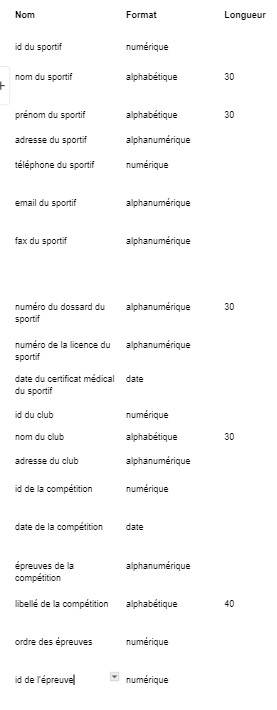
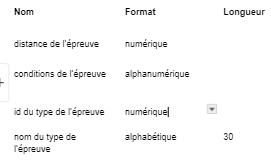
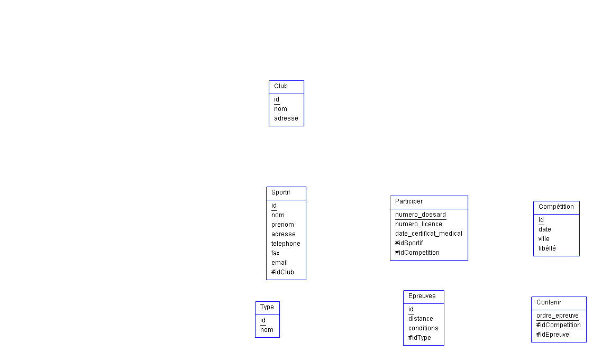
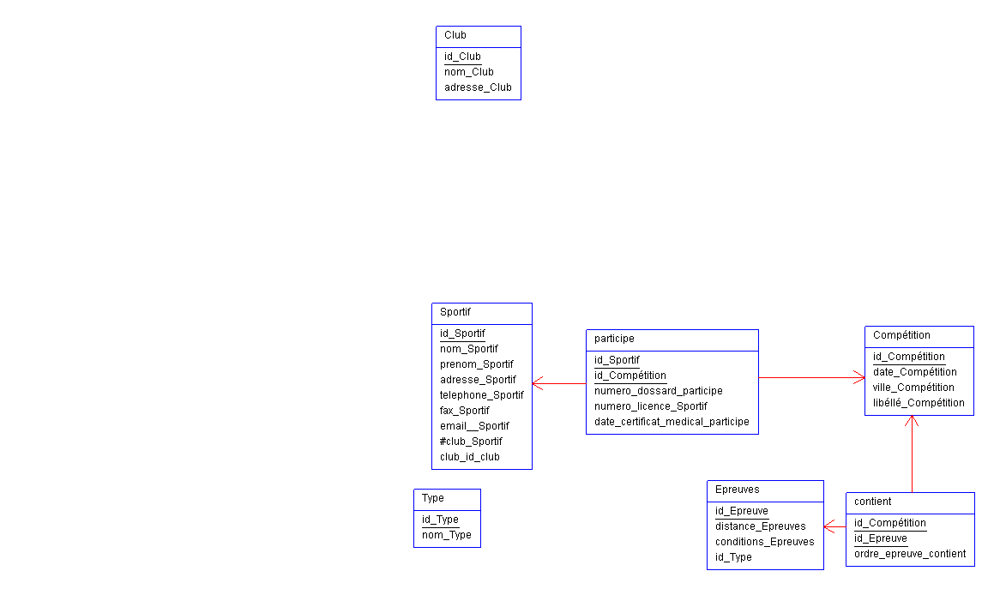

# Examen pratique de modélisation de données

## Sujet 1

### Dictionnaire


### MCD


Type de produit `1,N` associé à Produit `1,1`

`1,N` car selon moi, un type de produit contiendra forcément au moins un produit dans sa catégorie.

### MLD


### MPD avec les commandes SQL


(les noms de mes propriétés ont changés touts seuls)

```sql
CREATE TABLE Type (
    id_type INTEGER PRIMARY KEY AUTOINCREMENT,
    nom VARCHAR(50)
);

CREATE TABLE Produit (
    id_produit INTEGER PRIMARY KEY AUTOINCREMENT,
    référence VARCHAR(50),
    désignation VARCHAR(100),
    descriptif TEXT,
    prix_ht INTEGER,
    id_type INTEGER,
    mains_oeuvre INTEGER,
    FOREIGN KEY (id_type) REFERENCES Type (id_type)
);

CREATE TABLE Fournisseur (
    id_fournisseur INTEGER PRIMARY KEY AUTOINCREMENT,
    raison_sociale VARCHAR(100),
    adresse VARCHAR(255)
);

CREATE TABLE Commande (
    id_commande INTEGER PRIMARY KEY AUTOINCREMENT,
    date DATE
);

CREATE TABLE Contenir (
    id_commande INTEGER,
    id_produit INTEGER,
    quantité INTEGER,
    date_livraison_prevue DATE,
    prix_négocié INTEGER,
    PRIMARY KEY (id_commande, id_produit),
    FOREIGN KEY (id_commande) REFERENCES Commande (id_commande),
    FOREIGN KEY (id_produit) REFERENCES Produit (id_produit)
);

CREATE TABLE Livrer (
    id_produit INTEGER,
    id_fournisseur INTEGER,
    référence_fournisseur VARCHAR(50),
    prix_achat_moyen INTEGER,
    PRIMARY KEY (id_produit, id_fournisseur),
    FOREIGN KEY (id_produit) REFERENCES Produit (id_produit),
    FOREIGN KEY (id_fournisseur) REFERENCES Fournisseur (id_fournisseur)
);

CREATE TABLE Date (
    date DATE PRIMARY KEY
);
```

### Exemple d'une commande

Voici une ligne de code pour récupérer depuis la table `Commande` la commande dont l'id est 1.

```sql
SELECT * 
FROM Commande 
WHERE id_commande = 1;
```


## Sujet 2

### Dictionnaire




### MCD


Sportif `0,1` possède un club `0,N`

`0,N` car un club peut ne posséder aucun adhérants (admettons qu'il est en train de faire faillite) et il peut posséder plusieurs adhérants comme un club normal.

Idem pour une compétition: `0,N` car elle peut ne posséder aucun participants.

### MLD



### MPD avec les commandes SQL



(les noms de mes propriétés ont changés touts seuls)

Voici le code sql:

```sql
CREATE TABLE Club (
    id_club INTEGER PRIMARY KEY AUTOINCREMENT,
    nom VARCHAR(30),
    adresse VARCHAR
);

CREATE TABLE Sportif (
    id_sportif INTEGER PRIMARY KEY AUTOINCREMENT,
    nom VARCHAR(30),
    prénom VARCHAR(30),
    adresse VARCHAR,
    téléphone VARCHAR,
    fax VARCHAR,
    email VARCHAR,
    id_club INTEGER,
    FOREIGN KEY (id_club) REFERENCES Club (id_club)
);


CREATE TABLE Compétition (
    id_competition INTEGER PRIMARY KEY AUTOINCREMENT,
    date DATE,
    ville VARCHAR(30),
    libellé VARCHAR
);

CREATE TABLE Épreuve (
    id_epreuve INTEGER PRIMARY KEY AUTOINCREMENT,
    distance INTEGER,
    conditions TEXT,
    id_type INTEGER,
    FOREIGN KEY (id_type) REFERENCES TypeÉpreuve (id_type)
);

CREATE TABLE Participer (
    id_sportif INTEGER,
    id_competition INTEGER,
    num_dossard VARCHAR,
    num_licence VARCHAR,
    date_certificat_medical DATE,
    PRIMARY KEY (id_sportif, id_competition),
    FOREIGN KEY (id_sportif) REFERENCES Sportif (id_sportif),
    FOREIGN KEY (id_competition) REFERENCES Compétition (id_competition)
);

CREATE TABLE Contenir (
    id_competition INTEGER,
    id_epreuve INTEGER,
    ordre_epreuve INTEGER,
    PRIMARY KEY (id_competition, id_epreuve),
    FOREIGN KEY (id_competition) REFERENCES Compétition (id_competition)
);

CREATE TABLE Type (
    id_type INTEGER,
    nom VARCHAR(30)
);
```

### Exemple d'une commande:

Voici une ligne de code pour récupérer un sportif depuis la table `Sportif` le sportif dont l'id est 1.

```sql
SELECT * 
FROM Sportif 
WHERE id_sportif = 1;
```