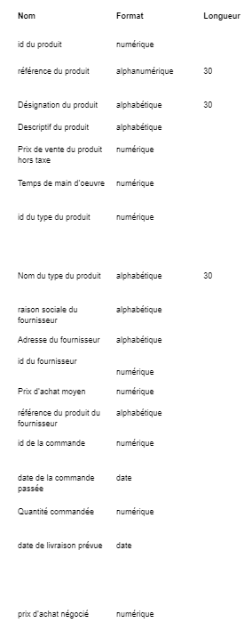

# Examen pratique de modélisation de données

## Sujet 1

### Dictionnaire



### MCD


Type de produit `1,N` associé à Produit `1,1`

`1,N` car selon moi, un type de produit contiendra forcément au moins un produit dans sa catégorie.

### MLD


### MPD avec les commandes SQL


```sql
DROP TABLE IF EXISTS Type;
CREATE TABLE Type (
    id_type INT AUTO_INCREMENT NOT NULL,
    nom_type VARCHAR(50),
    PRIMARY KEY (id_type)
) ENGINE=InnoDB;

DROP TABLE IF EXISTS Produit;
CREATE TABLE Produit (
    id_produit INT AUTO_INCREMENT NOT NULL,
    référence_produit VARCHAR(50),
    désignation_produit VARCHAR(100),
    descriptif_produit TEXT,
    prix_ht_produit INT,
    id_type INT,
    mains_oeuvre INT,
    PRIMARY KEY (id_produit)
) ENGINE=InnoDB;

DROP TABLE IF EXISTS Fournisseur;
CREATE TABLE Fournisseur (
    id_fournisseur INT AUTO_INCREMENT NOT NULL,
    raison_sociale_fournisseur VARCHAR(100),
    adresse_fournisseur VARCHAR(255),
    PRIMARY KEY (id_fournisseur)
) ENGINE=InnoDB;

DROP TABLE IF EXISTS Commande;
CREATE TABLE Commande (
    id_commande INT AUTO_INCREMENT NOT NULL,
    date_commande DATE,
    PRIMARY KEY (id_commande)
) ENGINE=InnoDB;

DROP TABLE IF EXISTS Contenir;
CREATE TABLE Contenir (
    id_commande INT NOT NULL,
    id_produit INT NOT NULL,
    quantité INT,
    date_livraison_prevue DATE,
    prix_négocié INT,
    PRIMARY KEY (id_commande, id_produit)
) ENGINE=InnoDB;

DROP TABLE IF EXISTS Livrer;
CREATE TABLE Livrer (
    id_produit INT NOT NULL,
    id_fournisseur INT NOT NULL,
    référence_fournisseur VARCHAR(50),
    prix_achat_moyen INT,
    PRIMARY KEY (id_produit, id_fournisseur)
) ENGINE=InnoDB;

DROP TABLE IF EXISTS DateCommande;
CREATE TABLE DateCommande (
    date_commande DATE PRIMARY KEY
) ENGINE=InnoDB;

ALTER TABLE Produit 
ADD CONSTRAINT FK_Produit_Type FOREIGN KEY (id_type) REFERENCES Type (id_type);

ALTER TABLE Contenir 
ADD CONSTRAINT FK_Contenir_Commande FOREIGN KEY (id_commande) REFERENCES Commande (id_commande);
ALTER TABLE Contenir 
ADD CONSTRAINT FK_Contenir_Produit FOREIGN KEY (id_produit) REFERENCES Produit (id_produit);

ALTER TABLE Livrer 
ADD CONSTRAINT FK_Livrer_Produit FOREIGN KEY (id_produit) REFERENCES Produit (id_produit);
ALTER TABLE Livrer 
ADD CONSTRAINT FK_Livrer_Fournisseur FOREIGN KEY (id_fournisseur) REFERENCES Fournisseur (id_fournisseur);
```

### Exemple d'une commande

Voici une commande pour récupérer depuis la table `Commande` la commande dont l'id est 1.

```sql
SELECT * 
FROM Commande 
WHERE id_commande = 1;
```


## Sujet 2

### MCD

